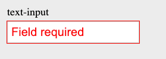
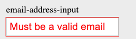

# QB_Form_Validator

This package allows you to validate form data for quickBase in a simple way.

## Installation
To include in your html file, simply include the following line:

    <script src="https://cdn.jsdelivr.net/gh/johnsyncs/QB_Form_Validator@2635b4cb6d0db067fb6e59ea01875bd63a0dcd52/QB_Form_Validator.js"></script>

## Usage
The function `validate` takes in an array of validation objects and returns either True or False. A validation objects is a dictionaries with 5 values: name, value, data_type, required and options. (options is only required for multiple choice inputs)
Each validation object corresponds with an input element (input and select elements). You can either provide the array yourself, your use getValidationObjects to automatically generate an array of validation objects from the form.

For example, we could set the output of `validate()` to a variable called `validated`:
```javascript
let validated = validate(validation_objects)
```

### Example Validation Object Array:
The following is an example of a validation object array named validation_objects:

```javascript
let validation_objects = [
        {
            id: "phone-number",
            value: document.getElementById("phone-number").value,
            data_type: "tel",
            required: false
        },
        {
            id: "first_name",
            value: document.getElementById("first_name").value,
            data_type: "text",
            required: true
        },
        {
            id: "personality",
            value: document.getElementById("personality").value,
            data_type: "multipleChoice",
            required: true,
            options: [
                "Default selected, disabled, and no value option",
                "Optimist",
                "Pessimist",
                "Hey I ordered a cheeseburger"
            ]
        },
    ]
```

## Validation Object Properties
* id: The id of the input element. This is used to find the input element in the DOM.

* value: The value of the input element. This is used to validate the input element.

* data_type: The data type of the input element. This is used to validate the input element.

* required: Whether or not the input element is required. This is used to validate the input element. If a required input is blank, it will fail validation.

* options: An array of valid options. If the input value does not match one of these options, the validation will fail.

## Data Types
The following values for `data-type` are supported by the validator:
* text (will fail validation unless input is of type text)
* number (will fail validation unless input is of type number)
* email (will fail validation unless input is a valid email address)
* tel (will fail validation unless input is a valid phone number)
* date (will fail validation unless input is a valid date)
* You do not need to include a data-type of 'multipleChoice' for a select element. The validator will automatically detect that it is a multiple choice input, and use the choices in the select element as the options.


# Using the validation object array to validate form data

using the validation object array from the example above, we can validate the form data like so:

```javascript
let validated = await validate(validation_objects)
```

if `validated` is true, then all of the form data is valid. If `validated` is false, then at least one of the form data is invalid, and the input elements will be highlighted with a red outline and a message will be displayed to the user:

If a user attempts to leave a required field blank, the following message will be displayed:
<br>
<br>If a user attempts to enter an invalid email, the following message will be displayed:
<br>

# How to configure HTML to use getValidationObjects()
The `getValidationObjects()` function returns an array of validation objects. This array can be used to validate the form data. To use `getValidationObjects()`, you must configure your HTML file such that input elements include the required attributes.

## Input Element Attributes
Each input element must have the following attributes:
* data-type: The data type of the input element. This is used to validate the input element.
* required: Whether or not the input element is required. Simply include the attribute to require a field. This is used to validate the input element. If a required input is blank, it will fail validation.
    
### Example elements
The following input element will be required, because it includes the required attribute. It will also be validated as a text input, because its data-type attribute equals 'text'.
 
```html
    <input required data-validate=true data-type=text type='text' id='text-input' placeholder='Text Field'/>
```

The following input element will not be required, because it does not include the required attribute. It will also be validated as a number input, because its data-type attribute equals 'number'.
 ```html
    <input data-validate=true data-type=number type='number' id='number-input' placeholder='Number Field'/>
```

## Example Implementation
The following example illustrates how to use both the `validate()` and `getValidationObjects()` functions to validate form data. In this example, code is being prevented from running unless `validate()` returns true. If `validate()` returns false, the form will not be submitted.

```html    
    
    // Example button which calls the validation functions
    <div class="submit-button">
        <button type="submit" onclick="validateAndSubmit()">Submit</button>
    </div>

    <script>

    async function validateAndSubmit() {
    
        // Retrieves all HTML elements containing the attribute:
        // data-validate=true | data-validate=True
        let validationObjects = await getValidationObjects()
        
        // Validates all returned elements that contained the data-validate attribute
        let validated = await validate(validationObjects)
        
        if (validated) {
            submit()
        }
    }
    function submit(){
        // Submit form data
    }
    </script>
```